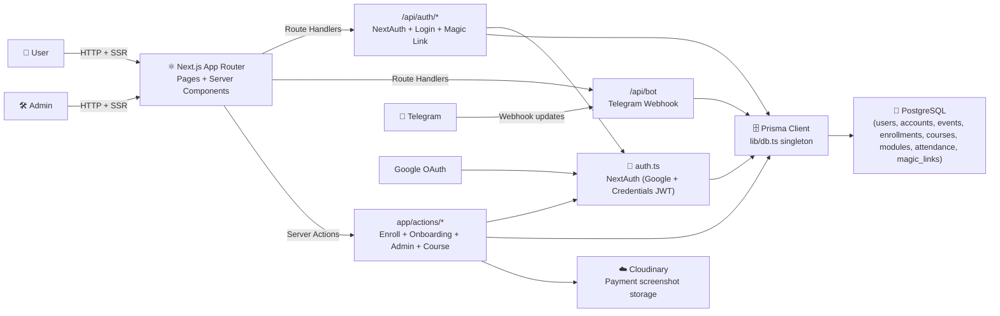

# LMS System

This repository is a Next.js LMS platform that supports authentication, onboarding, event/course enrollment, admin workflows, and Telegram bot integration.

## Backend Architecture Diagram



## Backend Flow (Short Explanation)

- **Entry point:** Users and admins interact with the **Next.js App Router** pages, which trigger server-side logic through route handlers and server actions.
- **Auth boundary:** `auth.ts` centralizes authentication via **NextAuth** with Google OAuth and credentials login, using Prisma as adapter and JWT sessions.
- **Business logic layer:** `app/actions/*` handles onboarding updates, payment/enrollment workflows, admin approval/rejection, and course/module management.
- **Integration layer:**
  - `/api/auth/login` and `/api/auth/magic` support Telegram/magic-link style flows.
  - `/api/bot` receives Telegram webhook events through Telegraf.
  - Enrollment payment evidence is uploaded to Cloudinary.
- **Data layer:** all server-side paths use `lib/db.ts` (Prisma singleton), backed by PostgreSQL models defined in `prisma/schema.prisma`.

## Main Backend Modules

- `auth.ts` → NextAuth config (Google + credentials, JWT session callbacks).
- `lib/db.ts` → Prisma client singleton for server runtime reuse.
- `prisma/schema.prisma` → domain models: User, Account, Event, Attendance, MagicLink, Course, Module, Enrollment.
- `app/api/auth/*` → auth and login route handlers.
- `app/api/bot/route.ts` → Telegram bot webhook endpoint.
- `app/actions/*.ts` → server actions for core LMS workflows.

## Getting Started

```bash
npm install
npm run dev
```

Open [http://localhost:3000](http://localhost:3000).
